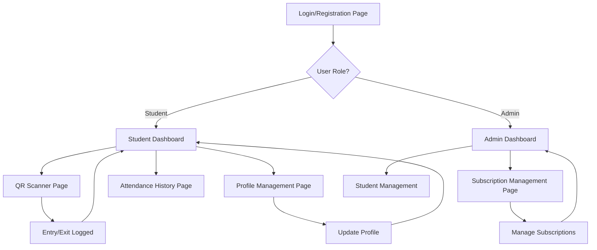

# Private Library Access App - Product Requirements Document

## 1. Product Overview

A smart entry tracking system for students who use a private study room or library space, enabling QR-based entry/exit logging with subscription management.

The app solves the problem of manual attendance tracking and subscription management for private library owners, while providing students with seamless access control and usage history.

Target market: Private study spaces, co-working libraries, and educational institutions seeking automated access management solutions.

## 2. Core Features

### 2.1 User Roles

| Role | Registration Method | Core Permissions |
|------|---------------------|------------------|
| Student | Email/Phone registration with Firebase Auth | Can scan QR codes, view personal profile, check subscription status, view entry/exit history |
| Admin | Admin invitation or manual setup | Can manage all students, view attendance logs, manage subscriptions, access dashboard analytics |

### 2.2 Feature Module

Our Private Library Access App consists of the following main pages:

1. **Login/Registration Page**: Firebase authentication, role-based access, password recovery
2. **Student Dashboard**: QR scanner, personal profile, subscription status, entry/exit history
3. **QR Scanner Page**: Camera-based QR scanning, entry/exit logging, timestamp recording
4. **Admin Dashboard**: Student management, attendance overview, subscription management, analytics
5. **Profile Management Page**: Personal details editing, subscription information, usage statistics
6. **Subscription Management Page**: Subscription plans, renewal options, payment status
7. **Attendance History Page**: Detailed entry/exit logs, duration calculations, export options

### 2.3 Page Details

| Page Name | Module Name | Feature description |
|-----------|-------------|---------------------|
| Login/Registration Page | Authentication System | Handle email/phone login with Firebase Auth, role assignment, password reset functionality, form validation |
| Student Dashboard | Main Interface | Display QR scanner access, current subscription status, recent entry/exit summary, quick profile access |
| QR Scanner Page | Entry/Exit Tracking | Scan QR code via camera, log entry/exit timestamps, prevent duplicate entries, show scan confirmation |
| Admin Dashboard | Management Interface | List all students with filters, view real-time attendance, manage subscriptions, export attendance data |
| Profile Management Page | User Profile | Edit personal details (name, email, phone, address), view subscription history, update contact information |
| Subscription Management Page | Subscription Control | Display subscription plans (daily/weekly/monthly), renewal options, payment status, expiration alerts |
| Attendance History Page | Usage Analytics | Show detailed entry/exit logs, calculate session durations, filter by date range, export CSV reports |

## 3. Core Process

**Student Flow:**
1. Student registers/logs in via email/phone
2. Student scans QR code at library entrance for entry
3. System logs entry timestamp and updates attendance
4. Student uses library facilities
5. Student scans QR code again for exit
6. System calculates session duration and updates logs
7. Student can view usage history and subscription status

**Admin Flow:**
1. Admin logs in with administrative credentials
2. Admin views dashboard with student attendance overview
3. Admin manages student subscriptions (renew/cancel)
4. Admin monitors real-time library usage
5. Admin exports attendance reports for analysis

## 4. User Interface Design

### 4.1 Design Style

- **Primary Colors**: Deep blue (#1E3A8A) for headers and primary buttons, light blue (#3B82F6) for accents
- **Secondary Colors**: Gray (#6B7280) for text, green (#10B981) for success states, red (#EF4444) for alerts
- **Button Style**: Rounded corners (8px radius), subtle shadows, hover effects with color transitions
- **Font**: Inter or Roboto, 16px base size, 14px for secondary text, 24px for headings
- **Layout Style**: Card-based design with clean spacing, top navigation bar, mobile-first responsive approach
- **Icons**: Feather icons or Heroicons for consistency, QR code icon prominently featured

### 4.2 Page Design Overview

| Page Name | Module Name | UI Elements |
|-----------|-------------|-------------|
| Login/Registration Page | Authentication Form | Clean centered form, blue gradient background, white card container, social login options |
| Student Dashboard | Main Interface | Grid layout with cards, QR scanner button prominently displayed, subscription status badge |
| QR Scanner Page | Camera Interface | Full-screen camera view, scanning overlay with guidelines, success/error feedback animations |
| Admin Dashboard | Data Tables | Responsive table layout, filter dropdowns, search functionality, action buttons for each row |
| Profile Management Page | Form Interface | Organized form sections, profile picture upload, save/cancel buttons, validation feedback |
| Subscription Management Page | Plan Cards | Card-based subscription plans, pricing display, status indicators, renewal call-to-action |
| Attendance History Page | Data Visualization | Timeline view of entries, duration charts, date picker filters, export button |

### 4.3 Responsiveness

The application is mobile-first with responsive design adapting to desktop screens. Touch-optimized interactions for mobile QR scanning, with larger touch targets and gesture-friendly navigation. Desktop version provides enhanced data visualization and bulk management capabilities for admin users.